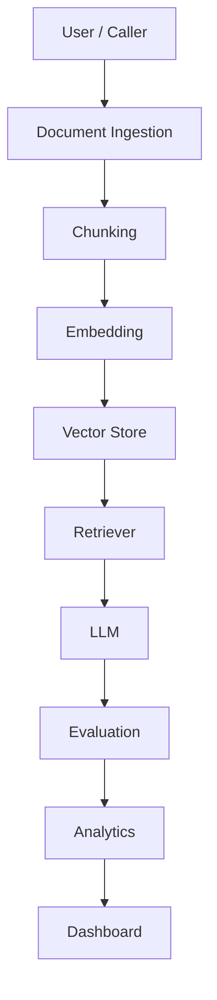
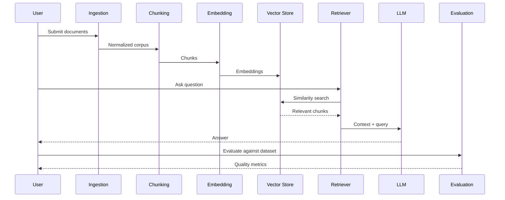

# Architecture

- **Purpose:** Define the structural model of Recon-OS so contributors can place new work
  correctly and reason about boundaries.
- **Audience:** Contributors, maintainers, and anyone evaluating the project's design.
- **When to update:** When a component is added, removed, or its responsibility changes.
- **Expansion:** Detailed module specifications live under
  [`docs/architecture/`](docs/architecture/); this document is the stable overview.

## Design philosophy

Recon-OS treats RAG as a pipeline of independently evolvable components rather than a
single framework. Each component:

- has one responsibility,
- exposes a stable interface,
- is replaceable without changing its neighbors,
- is observable and measurable in isolation.

This keeps the cost of change low: a new embedding provider or vector store is an
addition, not a refactor.

## Core principles

- **Interfaces before implementations.** Stable contracts are defined first; engines plug
  in behind them.
- **Reproducibility.** Datasets, splits, and experiments are versioned so results can be
  compared across time.
- **Measurement everywhere.** Every stage that can degrade quality must be evaluable.
- **Loose coupling.** Components communicate through interfaces, not concrete calls.
- **Progressive adoption.** Teams adopt one component at a time.

## Future modules

The following modules are planned. None are implemented yet; this section documents the
intended shape of the system.

| Module | Responsibility |
| ------ | -------------- |
| Dataset Engine | Corpus ingestion, versioning, and reproducible splits. |
| Chunking Engine | Deterministic, configurable document segmentation. |
| Embedding Engine | Pluggable text-to-vector encoding. |
| Vector Store Integration | Store-agnostic persistence and similarity search. |
| Retriever Framework | Query routing, hybrid search, and re-ranking. |
| Evaluation Engine | Retrieval and generation quality measurement. |
| Experiment Tracking | Versioned, comparable runs and metrics. |
| Dashboard | Observability and analytics surface. |
| CLI | Command-line entry point for local workflows. |
| SDK | Programmatic API for embedding Recon-OS in other systems. |

## Workspace and package topology

The repository is a pnpm workspace. Source is organized so future engines have an explicit
home and the dependency graph stays acyclic. See the
[monorepo layout in the README](../README.md#monorepo-layout) for the command reference.

| Package | Kind | Responsibility |
| ------- | ---- | -------------- |
| `@recon-os/core` | library | Shared domain types and interfaces used across the platform. |
| `@recon-os/config` | tooling | Shared TypeScript, ESLint, and Prettier configuration. |
| `@recon-os/sdk` | library | Reserved client contract for embedding Recon-OS. |
| `@recon-os/cli` | library | Reserved command-line surface. |
| `@recon-os/api` | application | Reserved backend service. |
| `@recon-os/web` | application | Reserved dashboard frontend. |

Dependency rules:

- Applications (`apps/*`) may depend on libraries (`packages/*`); libraries must not depend
  on applications. This prevents cycles and keeps libraries reusable.
- `core` is the base vocabulary; engine packages introduced later (dataset, chunking,
  embedding, and others) build on it.
- `config` is tooling only. It is consumed by the build/lint/format toolchain, never by
  application or library source.

These boundaries are enforced mechanically by `scripts/check-boundaries.mjs`, run in CI.

## Expected data flow

## Component responsibilities

### User / Caller

The entry point that initiates a request: a query, an evaluation job, or an experiment.
Owns no business logic; it only triggers the pipeline.

### Document Ingestion

Accepts source documents from arbitrary origins, normalizes them into a canonical
representation, and records provenance. It does not interpret content; it establishes a
trustworthy source of record.

### Chunking

Splits normalized documents into retrievable units. Strategy is configurable (size, overlap,
structure awareness) and deterministic so results are reproducible across runs.

### Embedding

Transforms chunks into vector representations through a pluggable provider. The engine is
provider-agnostic; changing providers must not affect upstream or downstream components.

### Vector Store

Persists embeddings and serves similarity search. Exposed through a store-agnostic
interface so any backend can be substituted without touching retrieval logic.

### Retriever

Given a query, selects relevant chunks. Supports hybrid strategies and re-ranking while
remaining independent of any specific store or embedder.

### LLM

Generates responses conditioned on retrieved context. Treated as a swappable component with
defined input and output contracts.

### Evaluation

Measures retrieval and generation quality against datasets and labeled relevance. Produces
metrics that feed experiment comparison and regression detection.

### Analytics

Aggregates evaluation and runtime signals into trends. Surfaces regressions and compares
configurations over time.

### Dashboard

Presents analytics and experiment state to humans. A read surface over the analytics and
tracking layers; it holds no decision logic.

## Example pipeline

A concrete run of the abstract flow above:

This sequence shows how a single caller drives both the build-time (ingestion through
storage) and run-time (retrieval through evaluation) halves of the system.
