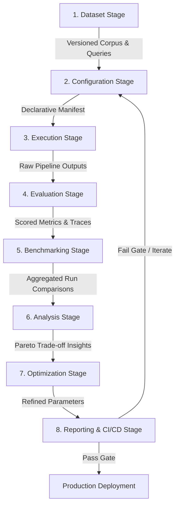

# Recon-OS: The Open Source Operating System for RAG Engineering

---

## 1. Executive Summary

Recon-OS is an open-source engineering platform designed specifically for Retrieval-Augmented Generation (RAG). It provides developers and infrastructure teams with a unified control plane to build, benchmark, evaluate, analyze, optimize, and continuously monitor production RAG systems. Recon-OS treats RAG as a rigorous software engineering discipline governed by versioned datasets, empirical metrics, deterministic experiments, and automated regression testing.

Recon-OS is explicitly **not** another RAG framework (such as LangChain or LlamaIndex), **not** another vector database (such as Qdrant or Pinecone), **not** another evaluation library (such as RAGAS or DeepEval), and **not** another LLM proxy (such as LiteLLM). These specialized tools solve critical individual problems across the AI stack. Recon-OS sits above them as a dedicated engineering layer, integrating existing technologies behind standardized interfaces and orchestrating their evaluation and operational lifecycle.

By abstracting components behind pluggable boundaries and providing structured experiment execution, Recon-OS replaces fragmented scripts and manual intuition with a systematic developer platform. Its primary goal is to ensure that every architectural decision in a RAG pipeline—from chunking strategies and embedding models to vector store indexes, retriever top-$k$ parameters, rerankers, and LLM prompts—is backed by reproducible data rather than subjective estimation.

---

## 2. Problem Statement

Building a production-grade Retrieval-Augmented Generation system remains one of the most unpredictable challenges in modern software engineering. While initializing a prototype requires only a few lines of code, scaling that prototype to meet enterprise requirements for accuracy, latency, cost, and safety exposes severe infrastructural gaps across current workflows.

### 2.1 Ecosystem Fragmentation
The current RAG ecosystem consists of isolated, single-purpose components. Engineers must independently wire together document loaders, text splitters, embedding APIs, vector indexes, retrieval algorithms, reranking models, evaluation scripts, and tracing tools. Because these tools lack shared data models and protocol standards, teams spend substantial engineering effort building custom glue code that is fragile, difficult to maintain, and impossible to reuse across projects.

### 2.2 Lack of Reproducibility
RAG pipelines are inherently non-deterministic. Changes in document ingestion, chunk overlapping, tokenization, vector indexing, or upstream LLM provider APIs introduce silent behavioral shifts. Today, most engineering teams have no systematic mechanism to version their raw document corpora, generated chunk sets, embedding representations, ground-truth evaluation datasets, or pipeline execution configurations. Consequently, reproducing a past result or determining the root cause of a quality regression is extraordinarily difficult.

### 2.3 Intuition-Driven Optimization
Without a standardized benchmarking platform, developers optimize RAG systems using trial-and-error heuristics. Engineering teams frequently change chunk sizes (e.g., switching from 256 to 512 tokens), swap embedding models (e.g., moving from `text-embedding-3-small` to `bge-large-en-v1.5`), or modify prompt templates without measuring the holistic impact on retrieval recall, context precision, generation faithfulness, token cost, or end-to-end latency across a representative dataset.

### 2.4 Invisible Quality Regressions
In traditional software engineering, continuous integration (CI) pipelines execute test suites to block breaking changes. In RAG engineering, updating an ingestion parser or modifying a vector index configuration can silently degrade retrieval quality for critical query subsets without raising system errors. Without automated regression testing and differential analysis, quality drops are often identified by end users in production rather than by automated build systems.

### 2.5 Multi-Dimensional Trade-Off Blind Spots
Optimizing a RAG system requires balancing conflicting constraints:
* Increasing retrieval top-$k$ improves context recall but inflates LLM token costs, increases generation latency, and risks context distraction.
* Switching to a larger embedding model improves semantic matching but increases vector index memory footprints and search latency.
* Applying heavy re-ranking models boosts relevance scores but adds tens or hundreds of milliseconds of overhead per request.

Current tooling does not provide multi-dimensional Pareto frontier analysis to help engineers select the optimal configuration for their specific cost, performance, and accuracy budgets.

---

## 3. Existing Ecosystem

The modern AI ecosystem has produced specialized tools that address distinct stages of the RAG pipeline. Understanding where Recon-OS fits requires examining these tool categories and identifying the missing integration layer.

| Tool Category | Exemplar Technologies | Core Functionality | Limitations as an Infrastructure Layer |
| :--- | :--- | :--- | :--- |
| **Orchestration Frameworks** | LangChain, LlamaIndex | Component chaining, document loading, agent abstraction, prompt construction. | Focused on application construction and developer onboarding rather than formal benchmarking, experiment versioning, or platform-level regression control. |
| **Model Proxies & Gateways** | LiteLLM | Unified API interface for multi-provider LLMs, load balancing, cost tracking. | Solves model access and fallback logistics, but does not measure retrieval quality, chunk validity, or RAG context utilization. |
| **Evaluation Libraries** | RAGAS, DeepEval | Algorithmic and LLM-assisted evaluation metrics (faithfulness, answer relevance, context precision). | Provide scoring functions and standalone Python interfaces, but lack integrated dataset versioning, cross-component benchmarking harnesses, and execution state persistence. |
| **Observability & Tracing** | Phoenix (Arize), LangSmith, Langfuse | Telemetry collection, execution trace visualization, latency tracking, production monitoring. | Capture runtime execution logs and traces, but are not designed for offline pipeline optimization, programmatic parameter sweep benchmarking, or multi-vector database comparisons. |
| **Vector Storage Engines** | Qdrant, Pinecone, Chroma, Weaviate, Milvus | Vector indexing, ANN search, hybrid sparse-dense retrieval, payload filtering. | Focus on storage and search efficiency. They do not evaluate whether retrieved chunks satisfy downstream LLM contextual requirements. |

```
┌─────────────────────────────────────────────────────────────────────────┐
│                           Recon-OS Platform                             │
│     (Dataset Versioning, Experiment Engine, Benchmarking, CI/CD)      │
└────────────────────┬───────────────────────────────┬────────────────────┘
                     │                               │
        ┌────────────┴────────────┐     ┌────────────┴────────────┐
        │  Orchestration & Proxy  │     │   Evaluation & Tracing  │
        │ (LangChain, LiteLLM...) │     │  (RAGAS, Phoenix...)    │
        └────────────┬────────────┘     └────────────┬────────────┘
                     │                               │
        ┌────────────┴───────────────────────────────┴────────────┐
        │                 Vector Storage Engines                  │
        │        (Qdrant, Pinecone, Weaviate, Milvus...)         │
        └─────────────────────────────────────────────────────────┘
```

### The Missing Engineering Layer
No single platform consolidates these components into a structured engineering workflow. Developers must manually extract evaluation metrics from libraries, pipe telemetry out of observability tools, re-index data across vector stores, and maintain custom scripts to compare different configurations. 

Recon-OS fills this void. It acts as the unifying control plane above frameworks, vector stores, proxies, and evaluation packages, standardizing how RAG pipelines are configured, executed, benchmarked, and optimized across their entire lifecycle.

---

## 4. Why Recon-OS Exists

Recon-OS exists to establish RAG engineering as a predictable, repeatable, and data-driven discipline.

Current solutions are insufficient because they treat RAG components as isolated implementation details rather than interdependent variables in a complex system. A change to a text splitting algorithm alters the semantic density of stored vectors, which changes distance metrics in the vector database, which alters the context provided to the LLM, which ultimately impacts generation accuracy and cost. Measuring these cascaded effects requires an overarching platform that manages state across the entire pipeline.

Recon-OS eliminates the friction of building production RAG by delivering:

1. **Vendor-Neutral Abstractions**: Stable interfaces that decouple application logic from specific embedding models, vector databases, rerankers, and LLM providers.
2. **Unified State Management**: A single system of record for document corpora, split chunks, vector indices, test queries, ground-truth annotations, and experiment results.
3. **Empirical Benchmarking Harness**: Automated execution engines that run parameter sweeps across combinations of chunking, embedding, vector store, and prompt configurations.
4. **CI/CD Integration**: Command-line interfaces and automation hooks that allow teams to treat RAG quality evaluation as a standard code build gate.

By focusing on infrastructure rather than framework abstractions, Recon-OS allows engineering teams to adopt best-of-breed tools without sacrificing architectural visibility or control.

---

## 5. Vision

The long-term vision of Recon-OS is to become the universal open-source standard for RAG engineering, benchmarking, and continuous optimization.

Five years from now, building a production RAG system should not rely on subjective prompt tweaking or unverified framework defaults. Instead:
* **Data-Driven Configuration**: Every production deployment of a RAG pipeline will be backed by a Recon-OS benchmark report proving that the selected configuration offers the optimal balance of recall, precision, latency, and cost for that domain.
* **Deterministic Quality Gates**: Continuous Integration pipelines will automatically execute Recon-OS regression suites on every pull request, preventing regressions in retrieval quality before code is merged.
* **Reproducible AI Science**: Academic researchers, enterprise architects, and open-source developers will share standardized Recon-OS dataset and experiment manifests, allowing anyone to verify benchmarks independently.
* **Automated System Optimization**: RAG platforms will utilize Recon-OS optimization algorithms to automatically tune chunk boundaries, distance thresholds, and reranking parameters based on live production feedback loops.

Recon-OS aims to redefine RAG infrastructure by prioritizing clarity, measurement, and stability over marketing hype.

---

## 6. Mission

> **To provide the open-source engineering platform that empowers developers to build, benchmark, evaluate, optimize, and observe production-grade Retrieval-Augmented Generation systems with absolute rigor, transparency, and reproducibility.**

---

## 7. Core Principles

Recon-OS is governed by nine foundational engineering principles:

### 7.1 Engineering First
Decisions are guided by empirical data, static typing, explicit contracts, and system stability. We reject hand-wavy heuristics, unverified claims, and opaque abstractions.

### 7.2 Modularity and Component Isolation
Every layer of the platform—ingestion, chunking, embedding, vector storage, retrieval, reranking, generation, and evaluation—is decoupled behind stable interfaces. Users can swap components without refactoring their broader pipeline.

### 7.3 Open Standards and Interoperability
Recon-OS uses open standards for datasets, configurations, execution traces, and benchmark reports. We avoid proprietary data formats and lock-in, ensuring seamless integration with the open-source AI ecosystem.

### 7.4 Reproducibility and Determinism
An experiment executed twice under the same configuration manifest and dataset version must yield identical metrics. All operational parameters, seed values, model IDs, and hardware metadata are tracked.

### 7.5 Developer Experience (DX) and Ergonomics
Infrastructure tools must be intuitive. Recon-OS provides a first-class Command Line Interface (CLI), a typed Software Development Kit (SDK), declarative YAML configurations, and clear diagnostic messaging.

### 7.6 Deep Observability and Auditability
Every evaluation score must be traceable to raw data. Developers can inspect the exact document source, split chunk, vector representation, search score, context window assembly, and LLM prompt that generated a specific metric.

### 7.7 Transparency and Rigorous Metrics
Metrics used in Recon-OS are explicitly defined, mathematically sound, and fully documented. We prioritize explainable, deterministic statistical measurements alongside LLM-assisted evaluation protocols.

### 7.8 Scalability and Cloud-Native Architecture
Recon-OS operates effectively on a developer's local machine for quick testing, and scales seamlessly to distributed cloud environments for enterprise-scale benchmarking across millions of vectors.

### 7.9 Community-Driven Development
The platform is built in the open. Architecture choices, feature proposals, and capability additions are discussed transparently through Open Source RFCs (Requests for Comments) and open governance.

---

## 8. Platform Capabilities

Recon-OS provides a comprehensive suite of capabilities designed to cover every phase of the RAG engineering lifecycle.

```
                                  ┌──────────────────────────────────────────────────┐
                                  │             Dataset Management                   │
                                  │   (Corpus Versioning, Synthetic Q&A Generation)  │
                                  └─────────────────────────┬────────────────────────┘
                                                            │
                                  ┌─────────────────────────┴────────────────────────┐
                                  │         Pipeline Execution Engine                │
                                  │    (Pluggable Chunking, Embedding, Vector Store) │
                                  └─────────────────────────┬────────────────────────┘
                                                            │
         ┌──────────────────────────────────────────────────┼──────────────────────────────────────────────────┐
         │                                                  │                                                  │
┌────────┴─────────────────────────┐      ┌─────────────────┴──────────────────┐      ┌─────────────────┴──────────────────┐
│      Retrieval Benchmarking      │      │     Vector Database Comparison     │      │       Evaluation & Lineage         │
│ (Recall@k, MRR, NDCG, Precision) │      │ (Search Latency, Memory Footprint) │      │  (Faithfulness, Hallucination)     │
└────────┬─────────────────────────┘      └─────────────────┬──────────────────┘      └─────────────────┬──────────────────┘
         │                                                  │                                                  │
         └──────────────────────────────────────────────────┼──────────────────────────────────────────────────┘
                                                            │
                                  ┌─────────────────────────┴────────────────────────┐
                                  │             Analytics & Reporting                │
                                  │    (Pareto Frontier Plots, Differential Diffs)   │
                                  └──────────────────────────────────────────────────┘
```

### 8.1 Dataset Management
* **Corpus Versioning**: Immutable snapshotting of document collections, ensuring that benchmarking runs are tied to precise content states.
* **Golden Dataset Curation**: Tooling for creating, importing, annotating, and managing test query sets paired with ground-truth document references.
* **Synthetic Q&A Generation**: Automated generation of domain-specific evaluation query sets using configurable LLM strategies with human-in-the-loop verification hooks.

### 8.2 Chunking Engine
* **Pluggable Splitting Strategies**: Support for fixed-size, sentence-aware, recursive character, markdown structure-aware, code AST, and semantic distance-based chunking.
* **Chunk Inspection & Visual Diffing**: Interactive tools to analyze chunk boundary placement, token length distribution, and semantic overlap across strategies.

### 8.3 Embedding Benchmarking
* **Cross-Provider Evaluation**: Parallel benchmarking of embedding models (e.g., OpenAI, Cohere, HuggingFace, VoyageAI, local SentenceTransformers).
* **Dimensionality & Metric Analysis**: Quantitative evaluation of distance metrics (Cosine, Euclidean, Dot Product) and vector reduction techniques (e.g., Matryoshka embeddings).

### 8.4 Retriever Benchmarking
* **Information Retrieval Metrics**: Native computation of classical IR metrics including Recall@$k$, Precision@$k$, Mean Reciprocal Rank (MRR), and Normalized Discounted Cumulative Gain (NDCG@$k$).
* **Hybrid Search Tuning**: Evaluation of hybrid retrieval pipelines combining sparse keyword search (BM25) with dense vector search across varying alpha weights.
* **Reranking Optimization**: Benchmarking cross-encoder rerankers (e.g., Cohere Rerank, BGE-Reranker) to evaluate latency-versus-relevance trade-offs.

### 8.5 Vector Database Comparison
* **Cross-Store Performance Benchmarking**: Side-by-side execution of search workloads across Qdrant, Pinecone, Chroma, Weaviate, Milvus, and pgvector.
* **Resource Consumption Profiling**: Measurement of index build times, memory footprints, query latency distributions (p50, p95, p99), and throughput (QPS).

### 8.6 LLM Benchmarking
* **Context Utilization & Distraction Analysis**: Measuring model performance when relevant information is placed at different positions within the context window (e.g., lost-in-the-middle phenomena).
* **Generation Metrics**: Evaluation of model outputs for context relevance, answer accuracy, semantic similarity to reference answers, and compliance with structural constraints.

### 8.7 Prompt Benchmarking
* **System Prompt Optimization**: Systematic evaluation of system prompt variants, context formatting strategies, and instruction structures.
* **Few-Shot Exemplar Selection**: Testing how different zero-shot and few-shot example sets influence model adherence and hallucination rates.

### 8.8 Evaluation Engine
* **Hybrid Evaluation Harness**: Seamless integration of deterministic algorithmic scoring (BLEU, ROUGE, Exact Match) with LLM-assisted evaluation frameworks (RAGAS, DeepEval).
* **Explainable Metric Tracing**: Detailed score breakdowns showing why a specific score was assigned, including identified context contradictions and hallucinated spans.

### 8.9 Experiment Tracking
* **Versioned Experiment Lineage**: Automatic tracking of every pipeline parameter (chunk size, overlap, embedding model, distance metric, top-$k$, prompt, LLM ID, temperature).
* **Differential Run Comparison**: Visual and programmatic diffing between separate experiment runs to identify exact performance deltas.

### 8.10 Visualization & Analytics
* **Interactive Benchmarking Dashboards**: Rich visual displays highlighting Pareto frontiers across accuracy, latency, and cost dimensions.
* **Error Clustering**: Automated categorization of failing query patterns to isolate systemic retrieval or generation weaknesses.

### 8.11 Reporting & Exporting
* **Standardized Artifact Generation**: Automated export of benchmark reports into HTML, PDF, Markdown, and JSON formats for team distribution and audit compliance.
* **CI Build Summaries**: Concise pull-request summary graphics and tables suitable for GitHub/GitLab automated comments.

### 8.12 Automation & CI/CD
* **Regression Test Execution**: Command-line execution modes designed to run inside GitHub Actions, GitLab CI, or Jenkins pipelines.
* **Configurable Quality Thresholds**: Failure triggers based on metric thresholds (e.g., fail build if Recall@5 drops below 0.85 or p95 latency exceeds 400ms).

### 8.13 Command Line Interface (CLI)
* **Developer Workflow Command Suite**: Powerful `recon` CLI for local project initialization, dataset versioning, experiment execution, benchmark comparison, and report generation.

### 8.14 Software Development Kit (SDK)
* **Programmatic Control Surface**: Fully typed SDKs (TypeScript/JavaScript and Python) allowing developers to trigger benchmarks, define custom component adapters, and ingest evaluation telemetry programmatically.

### 8.15 Application Programming Interface (API)
* **REST/gRPC Control Plane Services**: Centralized API backend (`@recon-os/api`) for remote execution orchestration, enterprise dataset storage, and persistent experiment tracking.

### 8.16 Ecosystem Integrations
* **First-Class Connectors**: Native adapters for LangChain, LlamaIndex, LiteLLM, Qdrant, Pinecone, Chroma, Weaviate, Milvus, RAGAS, DeepEval, Phoenix, and major model provider APIs.

---

## 9. Engineering Workflow

Recon-OS structures the development lifecycle into an iterative, eight-stage pipeline.



### Stage 1: Dataset Versioning & Preparation
Developers register raw document collections and evaluation queries using the Recon-OS CLI or SDK. The platform snapshots document checksums and query definitions, producing an immutable dataset version identifier (e.g., `ds_v1.4.2`).

### Stage 2: Pipeline Configuration
Developers define one or more pipeline variants using a declarative YAML manifest or programmatic SDK builder. Configurations explicitly state chunking algorithms, embedding models, vector store connections, retrieval top-$k$, rerankers, prompt templates, and target LLMs.

### Stage 3: Orchestrated Execution
The Recon-OS execution engine processes the configured dataset through the selected pipeline components. The platform manages component setup, handles API rate-limiting, handles retries, and captures timing metrics for each sub-task.

### Stage 4: Multi-Dimensional Evaluation
Raw retrieval and generation outputs are processed by the evaluation engine. Deterministic IR metrics (Recall@$k$, MRR, NDCG) and LLM-assisted metrics (Faithfulness, Context Relevance) are calculated for every query.

### Stage 5: Experiment Benchmarking
The platform aggregates evaluation outputs into an experiment run record (e.g., `exp_run_8f9b2a`). Metrics are normalized across query sets, and hardware/API resource costs are calculated.

### Stage 6: Comparative Analysis
Developers use the Recon-OS CLI or Web Dashboard to analyze run metrics. Differential tools highlight queries that improved or degraded compared to a baseline run, while scatter plots display performance along Pareto frontiers (e.g., Recall vs. Latency).

### Stage 7: Parameter Optimization
Based on analysis insights, developers refine pipeline parameters—adjusting chunk sizes, changing distance thresholds, or selecting a higher-performing embedding model. The cycle repeats until performance targets are met.

### Stage 8: Reporting & Continuous Integration
Once an optimal configuration is validated, Recon-OS generates a formal benchmark report. The pipeline manifest is checked into source control, where automated CI/CD workflows run regression evaluations on future code changes before production deployment.

---

## 10. Future Roadmap

While Recon-OS focuses primarily on Retrieval-Augmented Generation, its underlying evaluation, benchmarking, and experiment architecture provides a foundation for broader AI system engineering. 

The following opportunities represent potential long-term expansion vectors:

### 10.1 AI Agent Memory & Tool Benchmarking
Applying Recon-OS evaluation models to multi-step agent systems—benchmarking tool selection accuracy, plan execution fidelity, long-term memory retrieval, and multi-turn context compaction strategies.

### 10.2 Automated Prompt Engineering & Context Compression
Integrating automated prompt optimization techniques (e.g., DSPy-style instruction tuning) and context compression algorithms (e.g., LLMLingua) to automatically minimize token costs while preserving context fidelity.

### 10.3 Small Language Model (SLM) & Fine-Tuning Evaluation
Benchmarking specialized, task-specific small models (e.g., Llama-3-8B, Phi-3, Mistral) against frontier API models to evaluate cost-efficiency trade-offs for domain-specific retrieval tasks.

### 10.4 Enterprise AI Governance & Security Compliance
Extending the evaluation harness to audit pipelines for data leakage, prompt injection vulnerability, PII exposure, and regulatory compliance across corporate document repositories.

### 10.5 Real-Time Production Drift Detection
Extending offline experiment tracking into production environments by sampling live user queries, monitoring vector distribution shifts, and detecting model accuracy degradation over time.

### 10.6 Open Plugin & Module Marketplace
Establishing an ecosystem registry where community developers can publish, share, and evaluate custom chunking algorithms, domain-specific evaluator functions, and vector store adapters.

### 10.7 Managed Cloud Platform
Developing an enterprise-grade cloud service providing managed execution runners, distributed vector indexing clusters, long-term experiment persistence, and collaborative team dashboards.

---

## 11. Technology Philosophy

Recon-OS is guided by an integration-first architecture and a modular monorepo design.

### 11.1 Integration Over Replacement
Recon-OS does not seek to duplicate the functionality of existing open-source projects. Building another vector store, rewriting established LLM orchestration frameworks, or creating proprietary model evaluation functions creates unnecessary fragmentation.

Instead, Recon-OS acts as an infrastructural bridge. We build light, high-performance adapters around tools like Qdrant, LlamaIndex, RAGAS, and LiteLLM, providing a unified standard above them. This strategy allows developers to leverage existing investments while benefiting from platform-level evaluation and tracking.

### 11.2 Modular Monorepo Architecture
The repository is structured as a pnpm workspace with strict package boundaries:

```text
Recon-OS/
├── apps/
│   ├── api/             # API Service (@recon-os/api)
│   └── web/             # Web Interface (@recon-os/web)
├── packages/
│   ├── core/            # Domain Types & Interfaces (@recon-os/core)
│   ├── config/          # Shared Configuration (@recon-os/config)
│   ├── sdk/             # Client SDK (@recon-os/sdk)
│   └── cli/             # Command Line Interface (@recon-os/cli)
└── docs/                # Architecture & Vision Documentation
```

* **Zero Upward Dependencies**: Dependencies flow unidirectionally. Packages inside `packages/core` have zero dependencies on higher-level applications or SDKs, preventing circular coupling.
* **Strict Interface Isolation**: Component contracts (e.g., `VectorStoreAdapter`, `ChunkerStrategy`, `EvaluatorModule`) are defined as abstract interfaces in `@recon-os/core`. Implementations rely strictly on these contracts.
* **Language-Agnostic Design Standards**: While initial implementations use TypeScript/Node.js and Python, data models, configuration manifests, and trace protocols are defined using standard schemas (JSON Schema / OpenAPI / gRPC) to ensure cross-language compatibility.

---

## 12. Target Users

Recon-OS is built for professionals and teams who require rigorous engineering standards in AI application development.

| Target Audience | Primary Pain Points Solved | Key Platform Benefits |
| :--- | :--- | :--- |
| **AI / ML Engineers** | Fragmented evaluation scripts, unverified component selection, non-reproducible pipeline tweaks. | Systematic experiment tracking, automated parameter sweeps, formal IR and LLM evaluation metrics. |
| **Platform & Infrastructure Engineers** | Unclear resource usage, non-standard component wiring, lack of CI/CD regression testing for AI pipelines. | Declarative pipeline manifests, vector store benchmarking, automated CI/CD quality gates, typed SDKs. |
| **Open Source Contributors** | Complex codebases lacking clear contribution guidelines, architectural boundaries, or testing frameworks. | Clean monorepo architecture, comprehensive test suites, clear RFC process, high-quality documentation. |
| **Researchers & Academics** | Difficulty reproducing published RAG benchmarks across different datasets and vector indexes. | Immutable dataset snapshotting, versioned experiment runs, reproducible execution seeds and manifests. |
| **Startup Founders & Technical Leaders** | Risk of deploying inaccurate AI systems, unexpected token and database API bills, long debugging cycles. | Multi-dimensional Pareto cost/latency/accuracy analysis, clear quality visibility, faster time-to-market. |
| **Enterprise Architects** | Vendor lock-in across AI framework providers, lack of audit trails for AI decision pipelines. | Vendor-neutral component abstractions, complete execution lineage tracking, open data standards. |

---

## 13. Open Source Philosophy

Recon-OS is committed to building a sustainable, community-owned open-source project.

### 13.1 Documentation as a Core Deliverable
Documentation is treated with the same rigor as production code. A feature is incomplete until its architecture, interfaces, configuration keys, and CLI commands are documented clearly.

### 13.2 Architectural Simplicity
We prefer simple, readable code over clever abstractions. Maintainability and readability take precedence over premature performance optimizations.

### 13.3 Test-Driven Reliability
Core domain interfaces, execution utilities, and data parsers must maintain high unit and integration test coverage. Breaking changes without accompanying tests will not be accepted.

### 13.4 Transparent Governance
Project decisions, feature roadmaps, and architectural changes are discussed publicly in GitHub Issues and Discussions. We welcome RFC contributions from all community members regardless of corporate affiliation.

---

## 14. Success Criteria

Recon-OS measures success exclusively through engineering quality, system reliability, and community impact. We explicitly reject vanity metrics such as social media hype, star-gazing campaigns, or speculative business valuations.

### 14.1 Engineering Quality Metrics
* **100% Experiment Reproducibility**: Given an identical configuration manifest and dataset version, experiment runs must yield identical metric results across separate environments.
* **Low Benchmark Overhead**: The Recon-OS execution and telemetry layer should introduce negligible latency overhead (< 2%) relative to underlying pipeline operations.
* **Deterministic Test Coverage**: Comprehensive automated test validation across all workspace packages (`@recon-os/core`, `@recon-os/sdk`, `@recon-os/cli`, `@recon-os/api`).

### 14.2 Community & Adoption Metrics
* **Developer Onboarding Velocity**: A new contributor can clone the repository, install dependencies, run the test suite, and execute a local benchmark within 15 minutes.
* **Integration Ecosystem Breadth**: Maintaining well-tested, high-quality adapters across all major open-source vector databases, embedding APIs, orchestration frameworks, and evaluation tools.
* **Production Regression Prevention**: Adoption by engineering teams as a mandatory CI/CD gate, successfully catching retrieval and accuracy regressions before code reaches production.

---

## 15. Final Mission

Retrieval-Augmented Generation has emerged as the standard architectural pattern for connecting Large Language Models with private, domain-specific data. However, the software engineering practices surrounding RAG remain immature. Too many systems are assembled using unverified framework tutorials, tuned via subjective estimation, and deployed without adequate regression monitoring.

Recon-OS exists to solve this infrastructural crisis.

By creating a unified open-source engineering platform that integrates the best tools in the ecosystem behind stable interfaces, versioned datasets, and empirical benchmarking tools, Recon-OS transforms RAG development from trial-and-error guesswork into an exact, reproducible software engineering discipline.

We invite engineers, researchers, platform builders, and open-source contributors to join us in building the open-source operating system for RAG engineering.
