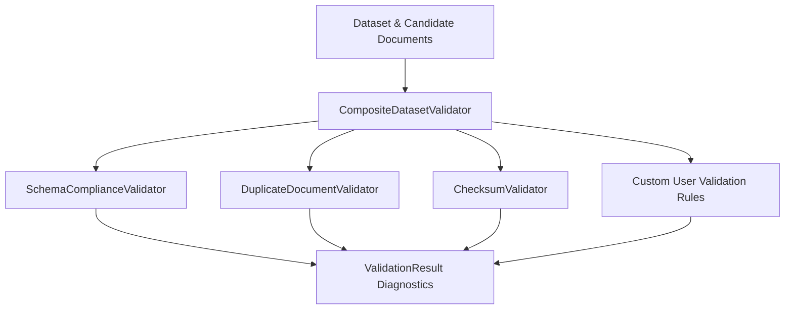

# Dataset Validation Framework Specification

- **Purpose:** Define the architectural model, contracts, and quality assurance protocols for the Recon-OS Dataset Validation Framework.
- **Audience:** Contributors, maintainers, and developers authoring or integrating dataset validation rules.
- **When to update:** When validation interfaces, standard rules, or diagnostic models evolve.

---

## 1. Overview & Problem Statement

Evaluating Retrieval-Augmented Generation (RAG) pipelines requires guaranteed dataset integrity. Corrupted character encodings, missing metadata keys, duplicated document IDs, or corrupted checksums invalidate benchmark comparisons and degrade model evaluation metrics.

The Recon-OS Dataset Validation Framework provides deterministic, automated pre-flight checks on candidate datasets before ingestion and evaluation pipeline execution.



---

## 2. Core Diagnostic Models & Contracts

All validation operations return strongly-typed, immutable `ValidationResult` diagnostics.

### 2.1 Diagnostic Severity

```typescript
export enum ValidationSeverity {
  ERROR = "error",
  WARNING = "warning",
  INFO = "info",
}
```

### 2.2 Validation Issue

Each detected anomaly is captured with field- and line-level context:

```typescript
export interface ValidationIssue {
  readonly code: string;
  readonly message: string;
  readonly severity: ValidationSeverity;
  readonly field?: string;
  readonly documentId?: string;
  readonly line?: number;
  readonly context?: Readonly<Record<string, unknown>>;
}
```

### 2.3 Validation Result

`ValidationResult` aggregates diagnostic issues into a queryable outcome:

```typescript
export interface ValidationResult {
  readonly isValid: boolean;
  readonly errors: readonly string[];
  readonly warnings?: readonly string[];
  readonly issues: readonly ValidationIssue[];
}
```

Factory helpers allow constructing outcomes cleanly:

- `ValidationResult.success(warnings?, issues?)`
- `ValidationResult.failure(errors | issues, warnings?)`
- `ValidationResult.fromIssues(issues)`
- `ValidationResult.combine(...results)`

---

## 3. Standard Built-in Validators

| Validator | Target | Invariants Enforced | Time Complexity |
| :--- | :--- | :--- | :--- |
| `DuplicateDocumentValidator` | Candidate Documents | Document ID uniqueness across collection | $O(N)$ |
| `ChecksumValidator` | Candidate Documents | Cryptographic checksums (SHA-256/MD5/SHA-1), character encoding integrity (detects `\uFFFD`, null bytes) | $O(N)$ |
| `SchemaComplianceValidator` | Dataset Entity | Required attributes (`id`, `name`, `version`, `source`), description bounds, tag limits, required metadata keys | $O(1)$ |
| `CompositeDatasetValidator` | Dataset & Documents | Sequential aggregation of multiple validators, fail-fast / collect-all modes | $O(N)$ |

---

## 4. Authoring Custom Validation Rules

Recon-OS provides two ways to author domain-specific validation rules:

### Method A: Functional Rule Hook

Register custom functional hooks directly on `CompositeDatasetValidator`:

```typescript
import {
  CompositeDatasetValidator,
  ValidationSeverity,
  Dataset,
  DatasetValidationContext,
} from "@recon-os/core";

const pipeline = CompositeDatasetValidator.createStandard();

// Register a custom check preventing confidential data ingestion
pipeline.addRule("DisallowConfidentialKeywords", (dataset: Dataset, context?: DatasetValidationContext) => {
  if (context?.documents) {
    for (const doc of context.documents) {
      if (doc.getContent().toLowerCase().includes("confidential")) {
        return {
          code: "CONFIDENTIAL_CONTENT_DETECTED",
          message: `Document "${doc.getId().getValue()}" contains forbidden confidential content`,
          severity: ValidationSeverity.ERROR,
          documentId: doc.getId().getValue(),
          field: "content",
        };
      }
    }
  }
  return null; // Passed
});
```

### Method B: Implementing the `DatasetValidator` Interface

Create reusable, class-based validator components:

```typescript
import {
  Dataset,
  DatasetValidator,
  DatasetValidationContext,
  ValidationResult,
  ValidationSeverity,
} from "@recon-os/core";

export class WordCountValidator implements DatasetValidator {
  public readonly name = "WordCountValidator";
  private readonly minWordCount: number;

  constructor(minWordCount: number = 5) {
    this.minWordCount = minWordCount;
  }

  public validate(dataset: Dataset, context?: DatasetValidationContext): ValidationResult {
    if (!context?.documents) {
      return ValidationResult.success();
    }

    const issues = [];
    for (const doc of context.documents) {
      const words = doc.getContent().trim().split(/\s+/).filter(Boolean);
      if (words.length < this.minWordCount) {
        issues.push({
          code: "INSUFFICIENT_WORD_COUNT",
          message: `Document "${doc.getId().getValue()}" word count (${words.length}) is below minimum (${this.minWordCount})`,
          severity: ValidationSeverity.WARNING,
          documentId: doc.getId().getValue(),
        });
      }
    }

    return ValidationResult.fromIssues(issues);
  }
}
```

Add the class to the composite pipeline:

```typescript
pipeline.addValidator(new WordCountValidator(10));
```

---

## 5. Engineering Constraints

1. **Deterministic Execution:** Validators evaluate purely based on candidate input data without ambient side effects.
2. **Non-Mutating:** Candidate datasets and documents are immutable; validators never modify inputs.
3. **Linear Time Complexity:** Rule algorithms must operate in $O(N)$ time relative to document count.
4. **Strict Typing:** All interfaces and models are strongly typed in TypeScript without `any` types.
